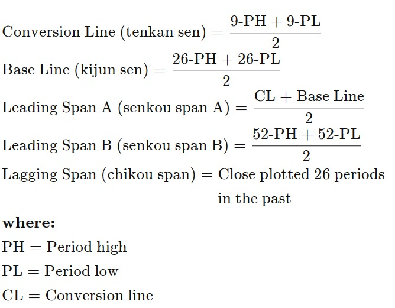
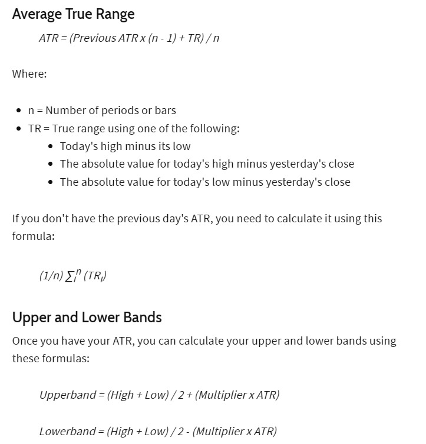

## Overview of Crypto market
- Cryptos in general are a volatile asset. Crypto market was bullish in 1st half of 2019 and bearish in the 2nd half. 
- In 2020, the market went on a bull run.
- 2021 and 2022 were volatile years. We saw 2 market crashes in 2 years.
- 2023 was sideways initially and later turned bullish.

## Major Parameters Explored
1. Ichimoku Cloud Strategy

2. Marubozu: Shadows of the candles are used to make the strategy design.

## Final Presented Strategies
1. Ensemble strategies with Supertrend, Marubozu and ichimoku cloud with rolling dynamic stop loss.

2. Ensemble Strategy - using Supertrend, Marubozu and Ichimaku cloud (Novel)
ADX, or Average Directional Index, is a technical indicator designed to measure the strength of a trend in a financial market. It quantifies the strength of a trend on a scale from 0 to 100, with higher values indicating a stronger trend. 
3. Dyanamic Stoploss 
It is based on ATR volatility and highest price for Ensemble strategy. 
4. Mutiple Timeframe Strategy
The true range indicator is taken as the greatest of the following: current high less the current low; the absolute value of the current high less the previous close; and the absolute value of the current low less the previous close.
5. To address any potential overfitting, we validated our strategy by generating random signals and dividing the dataframe into two halves. We then checked these random signals against the strategy. Since there was no mismatch, it indicates that our strategy is not overfitted, and no forward-looking bias is present.
6. 
## Code Structure
1. main_1_btc.py   ->   BTC : Double Timeframe Strategy Design
2. main_1_eth.py   ->   ETH : Double Timeframe Strategy Design
3. main_2_btc.py   ->   BTC : Ensemble Strategy with Dynamic Stop Loss (Novel)
4. main_2_eth.py   ->   ETH : SuperTrend Indicator Based Strategy (Optimized)

##Results
1. Obtained a Sharpe ratio of above 12 for ETH/USDT across double timeframes, with minimal drawdown and outperforming benchmark results in 13 out of 16 quarters.
